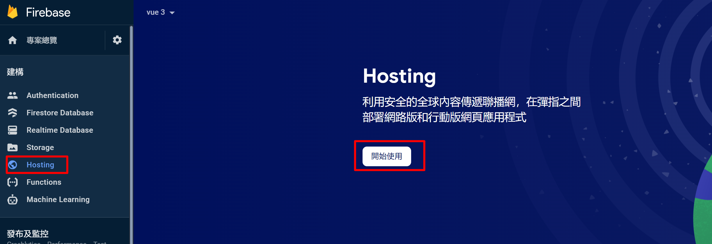
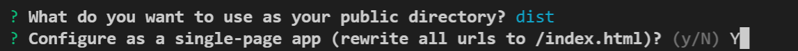
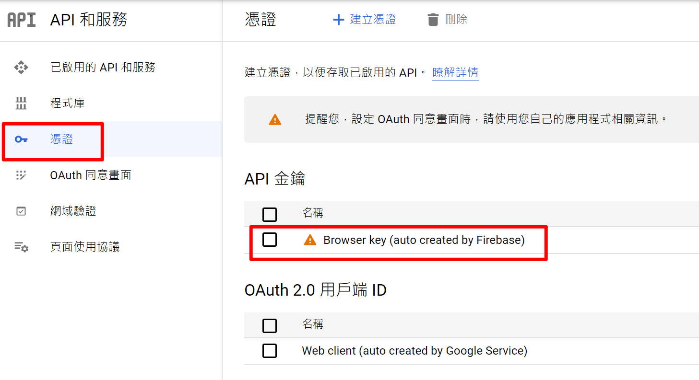
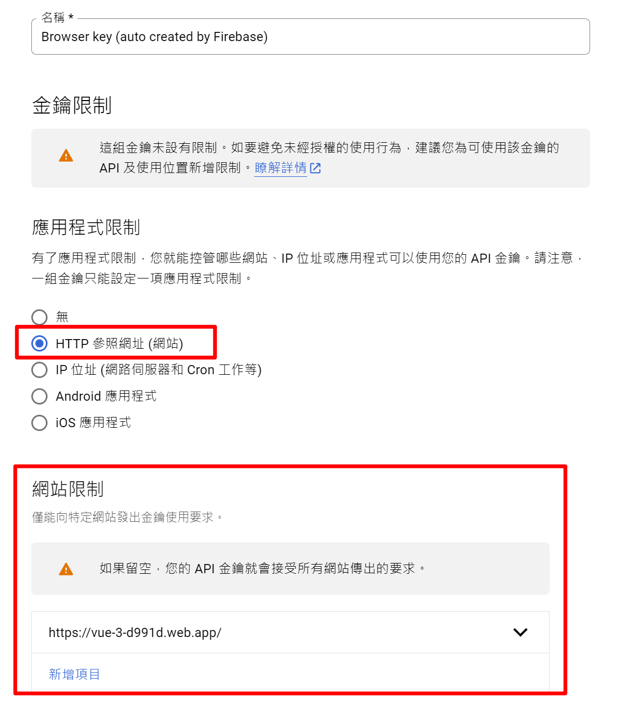

# Hosting

### setup hosting

### install cli tool

`npm install -g firebase-tools`

### login and init project

`firebase login`  
`firebase init`

### setup config

### build project

`yarn build`

### deploy

`firebase deploy`

### locking API to a domain
[Google APIs](https://console.cloud.google.com/apis/dashboard)

